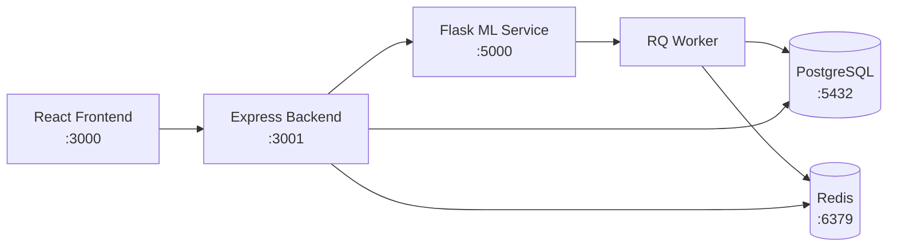

# Research Paper Analyzer

An AI-based web application that analyzes research papers, predicts quality scores, and recommends similar papers.

## Architecture



## Prerequisites

- **Node.js** 20 (used by the Express backend and React frontend)
- **Python** 3.11 (used by the Flask ML service and RQ worker)
- **Docker** and **Docker Compose** (for running all services together)

## Quickstart

1. **Clone the repository**

   ```bash
   git clone <repo-url>
   cd Reasearch-Paper-Analyzer-main
   ```

2. **Create a `.env` file** in the project root (copy from `.env.example`):

   ```bash
   cp .env.example .env
   ```

   The following environment variables are required (defaults shown):

   | Variable | Default | Description |
   |----------|---------|-------------|
   | `FLASK_HOST` | `0.0.0.0` | Flask binding address |
   | `FLASK_PORT` | `5000` | Flask service port |
   | `ALLOWED_ORIGINS` | `http://localhost:3000,http://localhost:3001` | CORS origins |
   | `REDIS_URL` | `redis://localhost:6379/0` | Redis connection string |
   | `ANALYSIS_CACHE_TTL_SECONDS` | `604800` | Analysis cache TTL (7 days) |
   | `RECOMMENDATION_CACHE_TTL_SECONDS` | `86400` | Recommendation cache TTL (1 day) |

3. **Start all services with Docker Compose**

   ```bash
   docker-compose up --build
   ```

   This starts six services defined in `docker-compose.yml`:

   | Service | Internal Port | Host Port | Description |
   |---------|--------------|-----------|-------------|
   | `frontend` | 80 | **3000** | React UI (served via Nginx) |
   | `backend` | 3001 | **3001** | Express.js API server |
   | `flask` | 5000 | **5000** | Python ML service |
   | `worker` | — | — | RQ background worker |
   | `postgres` | 5432 | **5432** | PostgreSQL 16 database |
   | `redis` | 6379 | **6379** | Redis 7 cache & message broker |

4. **Open the app**

   Navigate to [http://localhost:3000](http://localhost:3000) in your browser.

## Features

- Upload research papers (PDF)
- Automatic text extraction
- Feature engineering (word count, sentence count, etc.)
- ML-based scoring using Random Forest
- Similar paper recommendation using TF-IDF and cosine similarity
- Clean and responsive UI

## Tech Stack

- Frontend: React.js
- Backend: Node.js, Express.js
- ML API: Python Flask
- Machine Learning: Scikit-learn
- NLP: TF-IDF, Cosine Similarity

## How it Works

1. User uploads a PDF
2. Text is extracted using PyMuPDF
3. Features are calculated
4. ML model predicts score
5. Similar papers are retrieved

## Future Improvements

- Plagiarism detection
- Deep learning models (BERT)
- Cloud deployment

## License and Copyright

Copyright (c) 2026 Bushra-git. All rights reserved.

This repository is proprietary. No permission is granted to use, copy,
modify, distribute, or create derivative works without prior written
permission from the copyright holder.